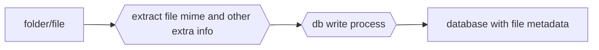
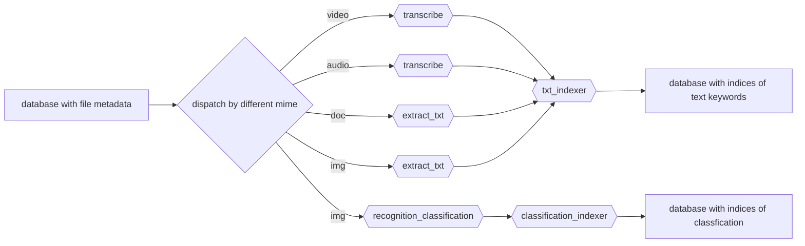
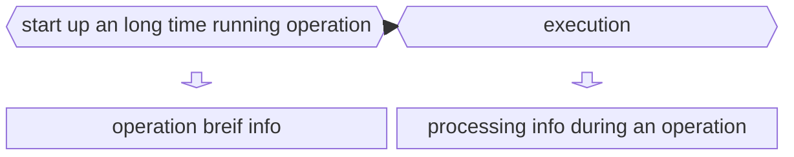

# files_analyser

## Process streamline 1: collecting file metadata

```mermaid
graph LR;
    ff["folder/file"]
    db["database with file metadata"]

    extract{{"extract file mime and other extra info"}}
    persist{{"db write process"}}

    ff -->extract;
    extract --> persist;
    persist --> db;
```

## Streamline 2: generating various indices for data extracted from different files

```mermaid
graph LR;
    db["database with file metadata"]
    db4txt["database with indices of text keywords"]
    db4cls["database with indices of classfication"]

    dispatch{dispatch by different mime}

    video{{"transcribe"}}
    audio{{"transcribe"}}
    doc{{"extract_txt"}}
    img2txt{{"extract_txt"}}
    img2cls{{"recognition_classification"}}
    txtidx{{"txt_indexer"}}
    clsidx{{"classification_indexer"}}

    db --> dispatch;
    dispatch -->|video| video;
    dispatch -->|audio| audio;
    dispatch -->|doc| doc;
    dispatch -->|img| img2txt;
    dispatch -->|img| img2cls;

    video --> txtidx;
    audio --> txtidx;
    doc --> txtidx;
    img2txt --> txtidx;

    img2cls --> clsidx;

    txtidx --> db4txt;
    clsidx --> db4cls;
```

## Streamline Manager

```mermaid
block-beta
columns 2
    startup{{"start up an long time running operation"}}
    exec{{"execution"}}

    startup ---> exec

    down1<[" "]>(down)
    down2<[" "]>(down)

    op["operation breif info"]
    oplog["processing info during an operation"]
```